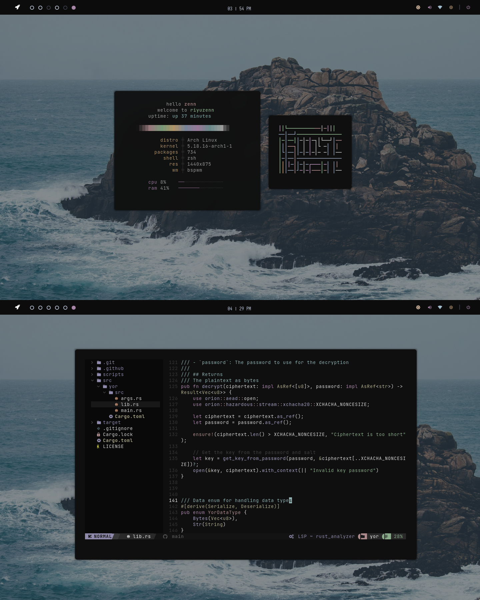

<div align="center">
  <h3>─────※ ·❆· ※─────</h3>
</div>

<div align="center">
  <h2>:sparkles: <samp>INFORMATION </samp> </h2>
  <a href="https://github.com/riyuzenn/dotfiles#construction-installation"><b><samp> installation </samp></b></a> |
  <a href="https://github.com/riyuzenn/dotfiles/tree/d4c436a41e36256e93bdc445829e75944bf7d714"><b><samp> previous rice </samp></b></a> |
  <a href="https://github.com/riyuzenn/dotfiles#keyboard-keybindings"><b><samp> keybindings </samp></b></a> |
  <a href="https://github.com/riyuzenn/dotfiles#-thanks-to"><b><samp> credits </samp></b></a> |
</div>
  <br>
   
   <h4><samp>If you like my setup kindly press that :star: button! </samp></h4> <br>
   
   > Note: some of configs were stolen. If you are the author, just open an issue.
   
   
   List of configurations I used to personalize my own system.  
   
   Feel free to use it & share with others.
   
   For the inspiration & acknoledgement, kindly check the [credit](https://github.com/riyuzenn/dotfiles#-thanks-to)
   section. This project would be nothing without them. 
   
   Here are more information about my setup:

   - **OS:** [arch](https://archlinux.org)
   - **WM:** [bspwm](https://github.com/baskerville/bspwm)
   - **Terminal:** [alacritty](https://github.com/alacritty/alacritty)
   - **Shell:** [zsh](https://www.zsh.org/)
   - **Bar:** [eww](https://github.com/elkowar/eww)
   - **Compositor:** [picom](https://github.com/ibhagwan/picom)
   - **Editor:** [neovim](https://github.com/neovim/neovim)
   - **Notification:** [dunst](https://github.com/dunst-project/dunst)
   - **Launcher:** [rofi](https://github.com/davatorium/rofi)
  - **Fonts**: {[Fira Code](https://github.com/tonsky/FiraCode),[JetBrains Mono](https://github.com/JetBrains/JetBrainsMono), [Iosevka Nerd](https://github.com/ryanoasis/nerd-fonts/tree/master/patched-fonts/Iosevka), [Material Design Icon](https://github.com/google/material-design-icons)}
  
<br></br>  

## :construction: Installation

Clone the repo and make sure to include submodules.
`git clone --recurse-submodules https://github.com/riyuzenn/dotfiles` or you can manually add the submodules
using `git submodule update --init --recursive`

### arch linux

Installing dependencies. 

```sh
# Recommended aur helper
paru -Sy --needed xorg xorg-xinit xorg-xsetroot \
  nitrogen polybar dunst rofi alacritty neovim \
  bspwm-rounded-corners sxhkd zsh firefox neofetch \
  maim gpick picom-jonaburg-git jgmenu cava
  
# set zsh as default shell
chsh -s $(which zsh)

# oh-my-zsh installation
sh -c "$(curl -fsSL https://raw.github.com/ohmyzsh/ohmyzsh/master/tools/install.sh)"

```
After installing denpendencies, you can now run the install script to automatically
create and write configurations. 

Information about the install script: 

- Create config directories
- Copy config directories
- Load wallpaper via nitrogen

```sh
$ chmod +x ./install && ./install
```

## :keyboard: Keybindings
 key | function |
| :--- | :-------- |
| <kbd>rightclick</kbd> | open jgmenu (when workspace is empty) |
| <kbd>super</kbd> + <kbd>space</kbd> | open app launcher (rofi) |
| <kbd>super</kbd> + <kbd>Enter</kbd> | open terminal (alacritty) |
| <kbd>printscr</kbd> | screenshot (maim) |
| <kbd>super</kbd> + <kbd>printscr</kbd> | snipping tool (maim) |
| <kbd>super</kbd> + <kbd>q</kbd> | close window |
| <kbd>super</kbd> + <kbd>tab</kbd> | focus next window |
| <kbd>super</kbd> + <kbd>f</kbd> | toggle fullscreen |
| <kbd>super</kbd> + <kbd>t</kbd> | toggle tiled |
| <kbd>super</kbd> + <kbd>d</kbd> | toggle floating |
| <kbd>super</kbd> + <kbd>left click</kbd> | move floating window |
| <kbd>super</kbd> + <kbd>right click</kbd> | resize floating window |
| <kbd>super</kbd> + <kbd>1</kbd>-<kbd>5</kbd> | view workspace | 
| <kbd>super</kbd> + <kbd>shift</kbd> + <kbd>1</kbd>-<kbd>5</kbd> | move window to workspace | 
| <kbd>super</kbd> + <kbd>shift</kbd> + <kbd>r</kbd> | restart bspwm |
| <kbd>super</kbd> + <kbd>shift</kbd> + <kbd>q</kbd> | quit bspwm |

## 💝 Thanks to

- [aishenreemo](https://github.com/aishenreemo) (inspiration | i stole one of his configs in my previous rice)
- [mountain theme](https://github.com/mountain-theme) (palette) 

<br>

<div align="center">
  
  <p>
	<a href="https://github.com/riyuzenn/dotfiles/blob/main/LICENSE"></a>
</p>
</div>
